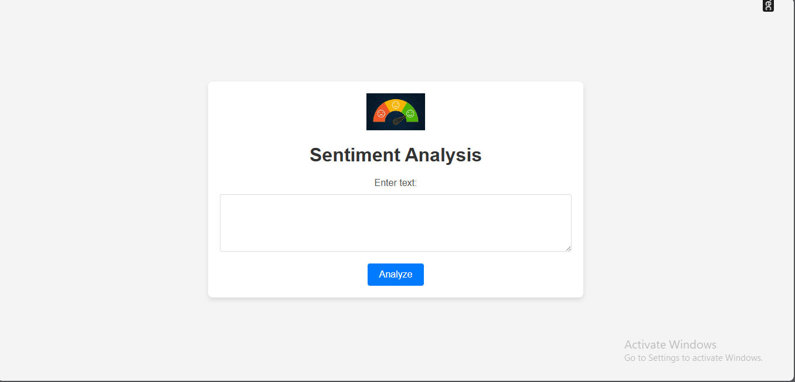
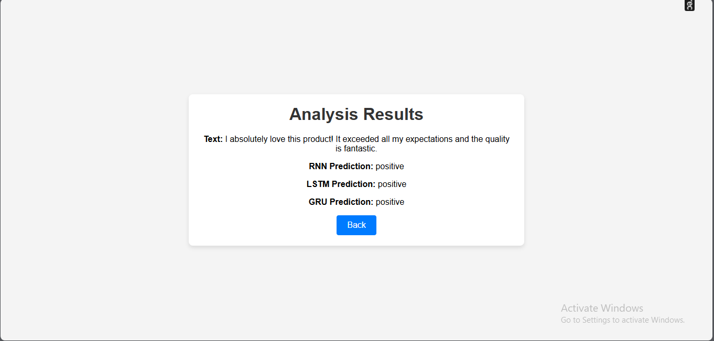
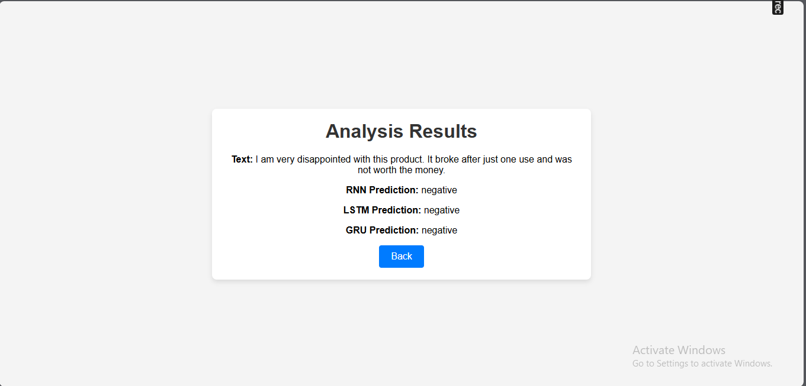

# Twitter Sentiment Analysis

This project is a sentiment analysis application that processes tweets and classifies them into positive, negative, or neutral sentiments. It uses three different models: RNN, LSTM, and GRU to perform the sentiment analysis. The application is built using Flask and Docker to ensure ease of deployment and scalability.

## Features

- **Sentiment Analysis Models**: RNN, LSTM, and GRU
- **Flask Web Application**: Provides an interface to analyze sentiment of tweets
- **Dockerized Application**: Easy deployment and environment consistency
- **HTML Templates**: For rendering the web interface
- **Static Assets**: CSS and images for styling

## Project Structure

```
twitter_sentiment_analysis/
├── app.py
├── Dockerfile
├── requirements.txt
├── templates/
│   ├── index.html
│   ├── results.html
├── static/
│   ├── css/
│   │   └── styles.css
│   ├── images/
│       ├── ui_screenshot.png
│       ├── positive_test.png
│       └── negative_test.png
└── models/
    ├── rnn_model.pkl
    ├── lstm_model.pkl
    ├── gru_model.pkl
    ├── label_encoder.pkl
    └── tokenizer.pkl

```

## Requirements

- Python 3.8+
- Flask
- TensorFlow 
- Docker

## Installation

1. **Clone the Repository**

   ```bash
   git clone https://github.com/MohamedKhalifa1/Twitter-Sentiment-Analysis.git
   cd Twitter-Sentiment-Analysis
   ```

2. **Install Dependencies**

   Create a virtual environment and install the required Python packages:

   ```bash
   python -m venv venv
   source venv/bin/activate
   pip install -r requirements.txt
   ```

## Running the Application

### Without Docker

1. **Run the Flask Application**

   ```bash
   python app.py
   ```

   The application will be accessible at `http://127.0.0.1:5000`.

### With Docker

1. **Build the Docker Image**

   ```bash
   docker build -t twitter-sentiment-analysis .
   ```

2. **Run the Docker Container**

   ```bash
   docker run -p 5000:5000 twitter-sentiment-analysis
   ```

   The application will be accessible at `http://localhost:5000`.


## HTML Templates

- **index.html**: Contains the form for user input.
- **results.html**: Displays the results of the sentiment analysis.

## Screenshots

Here are some screenshots of the application for review:

1. **UI Overview**
   
   

   The main interface where users can input tweets for sentiment analysis.

2. **Positive Sentiment Example**

   

   Example of the application classifying a tweet as positive.

3. **Negative Sentiment Example**

   

   Example of the application classifying a tweet as negative.


## Contact

For any questions or issues, please reach out to [my email](m.ashraf.20162002@gmail.com).
